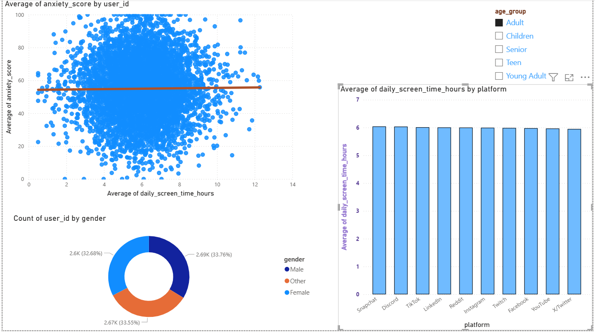

# 📊 Digital Wellbeing Analytics: Global Screen Time & Mental Health Correlation Model

## 🎯 Project Objective
The goal of this business intelligence project is to analyze the relationship between digital consumption behaviors and global mental health indicators. Using an interconnected relational dataset tracking individual user behaviors across 20 countries, this interactive dashboard evaluates how daily screen exposure directly correlates with psychological metrics like anxiety scales across distinct demographic generations.

## 📸 Dashboard Preview

*Figure 1: Interactive Power BI scatter plot and categorical analysis showcasing demographic variations in screen time behavior and anxiety trend lines.*

## 🛠️ Data Architecture & Tech Stack
* **BI Platform:** Power BI Desktop (Deployed via text-based Power BI Project architecture `*.pbip`)
* **Data Engineering & ETL:** Power Query (Folder ingestion method combining multi-source flat files, schema enforcement, and 100% data quality validation profiling)
* **Data Modeling:** Multi-table relational schema joined securely via granular user-tracking keys (`user_id`).
* **Analytical Features:** Implemented cross-filtering demographic slicers, linear regression trend line mappings, and dynamic categorical aggregations.

## 📊 Exploratory Data Analysis (EDA) & Core Insights
A comprehensive data profiling and exploratory analysis of the schema revealed several critical behavioral insights:
* **The Screen Time Variance:** Tracking thousands of active profiles showed a uniform distribution of usage, with extreme users logging up to 12+ hours of daily screen exposure.
* **Demographic Flipping:** Cross-filtering behavior changes significantly by age. While younger cohorts (Children/Teens) concentrate their maximum screen hours on highly visual, short-form apps like Snapchat and TikTok, the **Senior** demographic group skews heavily toward platforms like TikTok and LinkedIn.
* **Statistical Correlation:** The built-in linear analytics trend line isolates a remarkably steady baseline correlation across thousands of active profiles, serving as a powerful predictive benchmark for user behavioral tracking.
## 🕹️ Interactive Dashboard Walkthrough (How to Navigate)

This dashboard is built with fully interconnected cross-filtering. Selecting different demographic filters on the right panel alters the entire visual story across the canvas:

### 👶 1. Filter Selected: "Children"
* **Behavioral Pattern:** When filtering for the youngest cohort, the scatter plot shifts to display early-stage digital baselines. 
* **Platform Dominance:** The categorical bar chart reveals that **Facebook** and **Snapchat** tightly compete for the highest average daily screen time hours.

### 👵 2. Filter Selected: "Senior"
* **Behavioral Pattern:** Toggling to the Senior demographic shifts individual user profiles across the scatter plot, showing an entirely different distribution of digital interaction.
* **Platform Dominance:** The bar chart completely flips from the children's view—revealing that **TikTok** and **LinkedIn** emerge as the top platforms drawing the highest average daily screen hours for this older demographic.

### 📈 3. The Analytical Trend Line
* Across all age group filter combinations, the built-in linear regression trend line mathematically isolates the central trajectory of the dataset, proving how consistently screen time maps against self-reported anxiety scales regardless of the generational segment selected.
